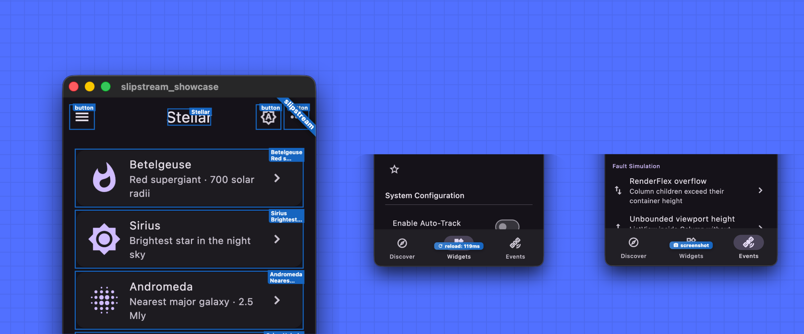

# Flutter Slipstream

Flutter Slipstream makes AI coding agents more effective on Dart and Flutter
projects. Available as a [Claude Code](https://claude.ai/code) plugin, a
[GitHub Copilot](https://github.com/features/copilot) plugin, and a
[Gemini CLI](https://github.com/google-gemini/gemini-cli) extension: Slipstream
addresses two structural problems agents face. A training cutoff that leads to
stale package choices and subtly wrong API signatures, and a lack of runtime
visibility into a running Flutter app — agents can't see screenshots, inspect
the widget tree, or verify that a state change took effect.

## Features

- **Live app inspection** — launch a Flutter app, take screenshots, inspect the
  widget tree, evaluate Dart expressions, and observe runtime errors, all from
  agent tool calls.
- **Tap, type, and scroll** — interact with the running app via semantics or
  widget finders; no test harness required.
- **Accurate package APIs** — retrieve any package's public API directly from
  the local pub cache as a compact Dart stub, version-matched and free of
  implementation noise.
- **Package validation hooks** — catch discontinued packages and outdated major
  versions before they land in `pubspec.yaml`.

## Installation

**Claude Code:**

```sh
claude plugin install flutter-slipstream
```

**GitHub Copilot:**

Coming soon — marketplace installation support is in progress.

**Gemini CLI:**

```sh
gemini extensions install https://github.com/devoncarew/flutter-slipstream
```

## Getting Started / Using Slipstream

Install the plugin, then work on Flutter projects as you normally would. No
special prompting is required — Slipstream works in the background.

**UI development workflow:** When building or debugging UI, ask the agent to run
the app. It will launch on a desktop device automatically, then iterate using
hot reload after each source edit. Because the agent can take screenshots and
inspect the widget tree, it catches overflow errors, layout surprises, and
rendering regressions on its own — without you having to describe what went
wrong.

**Package hygiene:** Whenever the agent adds a package — via `pub add` or by
editing `pubspec.yaml` directly — the hook checks pub.dev and warns if the
package is discontinued or if the constraint targets an outdated major version.
The agent sees the warning and can correct course before the bad dependency
lands.

**Optional: richer instrumentation.** Add
[`package:slipstream_agent`](https://pub.dev/packages/slipstream_agent) as a
dependency for finder-based interactions (tap by key, type, or text), scroll
support, and router-aware navigation. Without it, Slipstream still works well
via semantics and the Flutter inspector protocol.

## Tools

### Flutter UI agent (`inspector`)

MCP commands for launching, inspecting, and interacting with a running Flutter
app. Gives agents a [Playwright](https://playwright.dev/)-style interface to the
running app: take screenshots, inspect the widget tree, evaluate arbitrary Dart
expressions, and observe runtime errors with widget IDs.

<!-- inspector -->
<!-- prettier-ignore-start -->
| Command | Description |
|---------|-------------|
| `run_app` | Builds and launches the Flutter app. |
| `reload` | Applies source file changes to a running Flutter app. |
| `get_output` | Returns buffered app output and runtime events since the last call (or the last reload/restart). |
| `take_screenshot` | Captures a PNG screenshot of the running Flutter app. |
| `inspect_layout` | Use when debugging layout issues, overflow errors, or unexpected widget sizing. |
| `evaluate` | Evaluates a Dart expression on the running app's main isolate and returns the result as a string. |
| `get_route` | Returns the current navigator route stack with screen widget names and source locations. |
| `navigate` | Navigates the app to a route path. |
| `perform_tap` | Taps a widget located by a finder. |
| `perform_set_text` | Sets the text content of a text field located by a finder. |
| `perform_scroll` | Scrolls a Scrollable widget by a fixed number of logical pixels. |
| `perform_scroll_until_visible` | Scrolls a Scrollable widget until a target widget is visible in the viewport. |
| `get_semantics` | Returns a flat list of visible semantics nodes from the running Flutter app. |
| `perform_semantic_action` | Dispatches a semantics action on a widget by its semantics node ID or label. |
| `close_app` | Stops the running Flutter app and releases its session. |
<!-- prettier-ignore-end -->
<!-- inspector -->

### Package API retrieval (`packages`)

Retrieves a package's public API surface directly from the local pub cache and
returns it as a compact Dart stub — signatures only, no bodies, no private
members. Agents get accurate, version-matched API information without reading
raw source files or relying on training-data summaries.

<!-- packages -->
<!-- prettier-ignore-start -->
| Command | Description |
|---------|-------------|
| `package_summary` | Returns API summaries for Dart or Flutter packages; start here to orient on an unfamiliar package. |
| `library_stub` | Returns the full public API for one library as a Dart stub (signatures only, no bodies). |
| `class_stub` | Returns the public API for a single named class, mixin, or extension as a Dart stub (signatures only, no bodies). |
<!-- prettier-ignore-end -->
<!-- packages -->

### Package validation hooks

A `PreToolUse` hook that fires when an agent adds a package via
`flutter pub add` / `dart pub add` or edits `pubspec.yaml` directly. Emits
advisory warnings and lets the agent decide; never hard-blocks.

Checks:

- **Discontinued:** warns with the official replacement if one is listed.
- **Old major version:** warns when the constraint targets an older major than
  what pub.dev currently publishes (e.g. `http:^0.13.0` vs latest `1.x`).

## Contributing

See [CONTRIBUTING.md](CONTRIBUTING.md).
